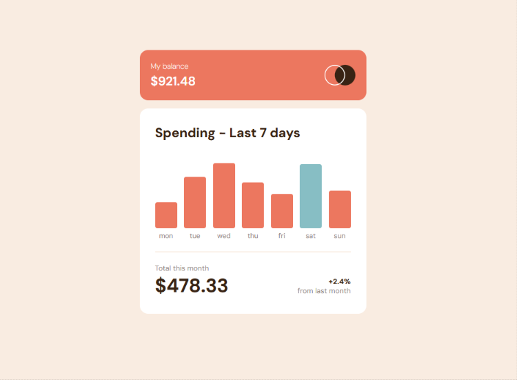

# 💸 Frontend Mentor - Expenses Chart Component Solution

This is a solution to the [Frontend Mentor - Expenses chart component challenge](https://www.frontendmentor.io/challenges/expenses-chart-component-e7yJBUdjwt).

---

## 📋 Table of Contents

- [📌 Overview](#-overview)
  - [🎯 The Challenge](#-the-challenge)
  - [🖼️ Screenshot](#️-screenshot)
  - [🔗 Links](#-links)
- [⚙️ My Process](#️-my-process)
  - [🛠️ Built With](#️-built-with)
  - [📚 What I Learned](#-what-i-learned)
  - [🔍 Useful Resources](#-useful-resources)
- [🙋‍♀️ Author](#-author)

---

## 📌 Overview

### 🎯 The Challenge

Users should be able to:

- ✅ View the bar chart and hover over the individual bars to see the correct amounts for each day.
- ✅ See the current day’s bar highlighted in a different colour.
- ✅ View an optimal layout depending on their screen size.
- ✅ Experience hover states on all interactive elements.
- 🌟 **Bonus**: Use JSON data to dynamically size the bars.

### 🖼️ Screenshot



## 🔗 Links

- 🔧 [Solution URL](https://github.com/Reem-A-Hikal/Expenses-Chart)
- 🌐 [Live Site URL](https://reem-a-hikal.github.io/Expenses-Chart/)

---

## ⚙️ My Process

### 🛠️ Built With

- ✅ Semantic **HTML5**
- ✅ **CSS Custom Properties**
- ✅ **Flexbox**
- ✅ **Mobile-first** responsive design
- ✅ **Vanilla JavaScript** (`fetch`, DOM manipulation, and dynamic styling)

### 📚 What I Learned

- 📊 How to dynamically style bars based on values from JSON data.
- 🧠 Using `Math.max` to scale the bars proportionally.
- 🎨 Creating CSS tooltips with smooth hover effects.
- 🧼 Writing clean, reusable DOM elements in JavaScript.

Example logic:
```js
const maxAmount = Math.max(...data.map(item => item.amount));
const height = (item.amount / maxAmount) * 100;
bar.style.height = `${height}%`;
